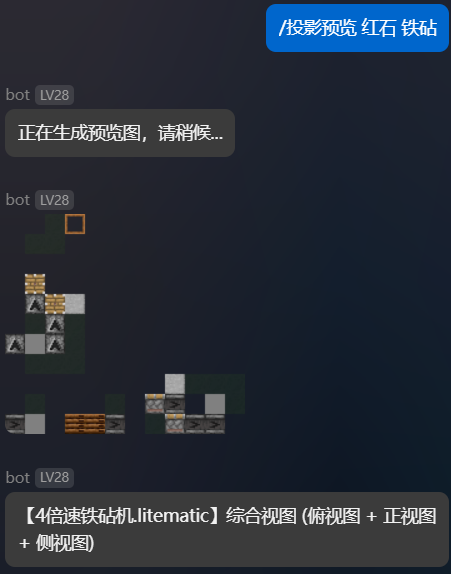

# astrbot_plugin_litematic

Minecraft `.litematic` 投影文件管理与 8K 高清 3D 渲染插件，适用于 AstrBot。

> [!NOTE]
> 这是 [AstrBot](https://github.com/AstrBotDevs/AstrBot) 的插件。
>
> [AstrBot](https://github.com/AstrBotDevs/AstrBot) 是一个 agentic 助手，适用于个人和群聊场景。支持部署在 QQ、Telegram、飞书、钉钉、Slack、LINE、Discord、Matrix 等数十个主流即时通讯平台。

[](https://github.com/kterna/astrbot_plugin_litematic)

## 功能特点

- **自动识别与渲染**：在群聊中发送 `.litematic` 文件，插件自动识别并生成 5 个视角的 8K 超高清 3D 渲染图，以合并转发消息打包发送
- **多视角 3D 渲染**：等轴测视图、正面视图、俯视图、侧面视图、侧上方俯视视图，全面展示建筑结构
- **8K 超高清分辨率**：默认 7680×4320（8K），放大后每个方块纹理清晰可见，支持 2K/4K/8K 自定义
- **材料清单统计**：自动分析投影文件所需的所有方块材料，包含组、盒、箱盒数量换算
- **分类管理**：按类别（建筑、红石等）整理存储 litematic 文件，支持自定义分类
- **文件上传/下载**：支持通过命令上传和获取投影文件
- **2D 预览**：生成投影的多角度 2D 切片预览图
- **3D 动画**：生成旋转/环绕/缩放动画 GIF
- **方块名称翻译**：自动将方块 ID 翻译为中文名称
- **静默模式**：可关闭自动渲染提示，直接静默发送结果




## 使用方法

### 自动渲染（推荐）

直接在群聊中发送 `.litematic` 文件，插件会自动：
1. 识别并保存文件到默认分类
2. 解析文件信息（名称、作者、方块数、尺寸）
3. 分析材料清单
4. 渲染 5 个 3D 视角的 8K 超高清渲染图
5. 以合并转发消息形式打包发送所有结果

### 命令列表

| 命令 | 说明 |
|------|------|
| `/投影` | 上传文件到默认分类 |
| `/投影 分类名` | 上传文件到指定分类 |
| `/投影列表` | 列出所有分类 |
| `/投影列表 分类名` | 列出分类下的文件 |
| `/投影获取 分类名 文件名` | 下载指定文件 |
| `/投影删除 分类名 文件名` | 删除指定文件 |
| `/投影删除 分类名` | 删除整个分类 |
| `/投影材料 分类名 文件名` | 分析材料清单 |
| `/投影信息 分类名 文件名` | 查看文件详细信息 |
| `/投影预览 分类名 文件名 [视角]` | 生成 2D 预览图 |
| `/投影3D 分类名 文件名` | 生成 3D 动画 GIF |

### 2D 预览视角

- `top`：俯视图
- `front` / `north`：正视图（北面）
- `side` / `east`：侧视图（东面）
- `south`：南面视图
- `west`：西面视图
- `combined`：综合视图（默认，含俯视+正视+侧视）

### 3D 动画参数

```
/投影3D 分类名 文件名 [动画类型] [帧数] [时长] [仰角] [分辨率]
```

- 动画类型：`rotation`（旋转，默认）、`orbit`（环绕）、`zoom`（缩放）
- 帧数：默认 36
- 时长：每帧毫秒数，默认 100
- 仰角：相机仰角，默认 30°
- 分辨率：如 `1920x1080`，默认 `native`

## 安装说明

1. 确保已安装 AstrBot v4.27.1+
2. 将插件文件夹 `astrbot_plugin_litematic` 复制到 AstrBot 的 `data/plugins` 目录
3. 确保插件目录下存在 `resource` 资源文件夹（包含 Minecraft 纹理和方块模型）
4. 重启 AstrBot
5. 使用 `/plugin litematic` 命令确认插件已加载

## 配置说明

在 AstrBot 面板中可配置以下选项：

| 配置项 | 说明 | 默认值 |
|--------|------|--------|
| `auto_render_3d` | 是否自动识别并渲染 .litematic 文件 | `true` |
| `auto_render_resolution` | 自动渲染分辨率 | `7680x4320`（8K） |
| `show_auto_render_hint` | 是否显示自动渲染提示消息 | `true` |
| `use_block_models` | 是否使用方块模型渲染 | `true` |
| `max_gif_size_bytes` | GIF 文件最大大小限制 | `5242880`（5MB） |
| `upload_timeout` | 文件上传超时时间（秒） | `300` |
| `max_workers` | 最大工作线程数 | `3` |

### 分辨率说明

默认渲染分辨率为 **7680×4320（8K）**，确保放大后每个方块纹理清晰可见。可根据需要调整：

- `1920x1080`：1080P，渲染快，文件小
- `2560x1440`：2K，平衡画质与性能
- `3840x2160`：4K，高画质
- `7680x4320`：8K（默认），超高清画质，建议 8GB+ 显存
- `native`：根据模型尺寸自动计算最佳分辨率

### 文件存储

投影文件存储在 `data/litematic/` 目录下，按分类组织为子文件夹。首次启动自动创建"建筑"和"红石"两个默认分类。

## 依赖要求

- Python 3.10+
- AstrBot v4.27.1+
- `litemapy`：Litematic 文件解析
- `pyvista`：3D 渲染引擎
- `numpy`：数值计算
- `Pillow`：图像处理
- `aiohttp`：异步 HTTP 请求

## 渲染视角说明

插件自动生成以下 5 个视角的渲染图：

| 视角 | 说明 | 相机位置 |
|------|------|----------|
| `iso` | 等轴测视图 | 从模型对角线上方俯视，展示三维全貌 |
| `front` | 正面视图 | 从 Z 轴正方向正视模型正面 |
| `top` | 俯视图 | 从模型正上方垂直俯视 |
| `side` | 侧面视图 | 从 X 轴正方向正视模型侧面 |
| `top_side` | 侧上方视图 | 从侧面和上方各 70% 距离处 45° 俯视 |

## 注意事项

- 仅支持 `.litematic` 格式文件
- 8K 渲染需要充足 GPU 显存（建议 8GB+），大型投影文件请耐心等待
- 插件已内置内存清理机制，渲染完成后自动释放 GPU 显存
- 部分聊天平台对图片大小有限制，如遇发送失败可降低分辨率
- 文件名支持模糊匹配，可只输入部分文件名
- 确保 `resource` 目录包含完整的 Minecraft 纹理资源包

## 作者信息

- 作者：蕭遞和TRAE WORK(ds v4 pro)
- 版本：v1.8.0
- 仓库：https://github.com/kterna/astrbot_plugin_litematic